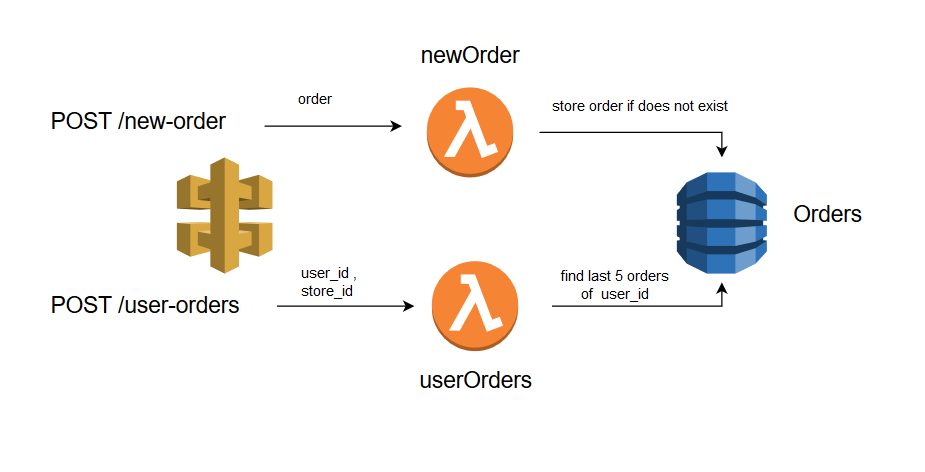

# AWS-Orders
## Simple Orders API



## API Documentation

### [/new-order](https://github.com/Cyb3rN4u7/AWS-Orders#post--new-order)

### [/user-orders](https://github.com/Cyb3rN4u7/AWS-Orders#post--user-orders)

### POST:  /new-order
Creates a new order if does not exist, if exists it returns a warning that it exists already and does not alter the database.
<br>
Each order should have:
- store_id: String
- order_id: String
- user_id: String
- grand_total : Number
<br>
**Sample Request body** :

```
{
"store_id" : "store01",
"order_id":"order01",
"user_id": "user01",
"grand_total" : 110.00
}

```

 _Expected returns_
<br>
 - **Order is new**

```
{
    "statusCode": 201,
    "body": {
        "message": "Order order01 submitted successfully"
    }
}

```

- **Order already exists (error)**

```
{
    "statusCode": 400,
    "error": "The conditional request failed"
}

```


### POST:  /user-orders
Returns the last 5 orders of the given user .
<br>
Each request should have:

- user_id : String


**Sample Request body**:

```
{
"user_id": "user1"
}

```


 **Sample Expected returns**
<br>
 - **User has ordered before**

```
{
    "statusCode": 200,
    "orders": [
        {
            "user_id": "user1",
            "grand_total": 11000,
            "order_id": "order7",
            "store_id": "store1",
            "timestamp": 1543928923665
        },
        {
            "user_id": "user1",
            "grand_total": 11000,
            "order_id": "order6",
            "store_id": "store1",
            "timestamp": 1543917649924
        },
        {
            "user_id": "user1",
            "grand_total": 11000,
            "order_id": "order5",
            "store_id": "store1",
            "timestamp": 1543917643882
        },
        {
            "user_id": "user1",
            "grand_total": 11000,
            "order_id": "order4",
            "store_id": "store1",
            "timestamp": 1543917637148
        },
        {
            "user_id": "user1",
            "grand_total": 11000,
            "order_id": "order3",
            "store_id": "store1",
            "timestamp": 1543917630790
        }
    ],
    "body": {
        "message": "Orders retrieved successfully"
    }
}

```

- **User does'nt have any orders (error)**

```
{
    "statusCode": 400,
    "error": "User user1 has no orders yet !"
}

```

